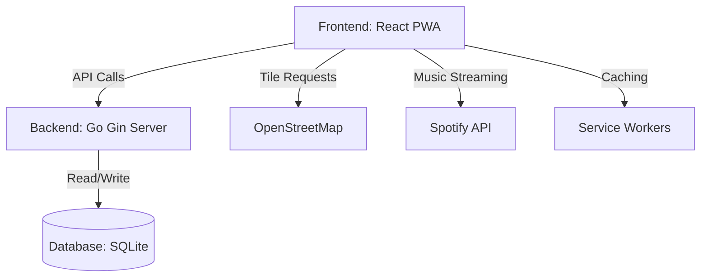
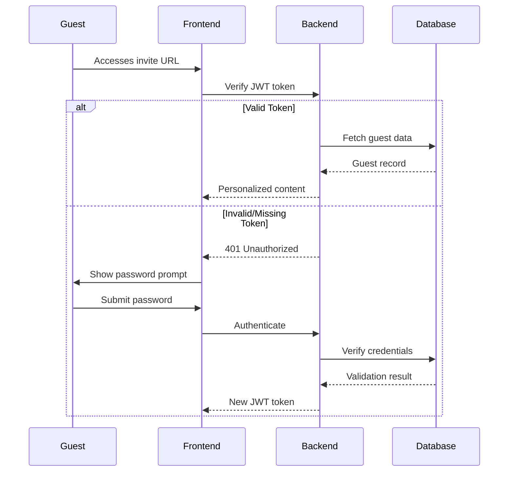
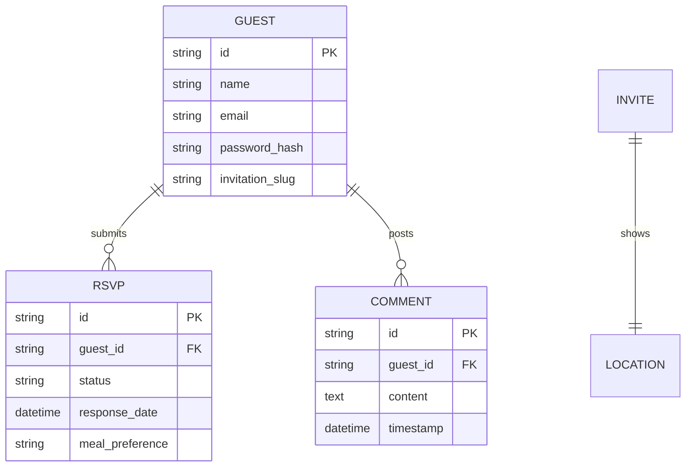

# Comprehensive Architecture Document: Wedding Invitation PWA with Go Backend

## 1. System Overview
**Objective**: Create a secure, performant wedding invitation PWA with offline capabilities  
**Core Components**:
- React PWA frontend
- Go backend (Gin framework)
- SQLite database
- Service workers for offline functionality
- OpenStreetMap integration
- Spotify playback API

## 2. Architecture Diagram

## 3. Technology Specifications

### Frontend (React PWA)
| Component       | Technology          | Purpose                          |
|-----------------|---------------------|----------------------------------|
| Framework       | React 18            | UI rendering and state management|
| Routing         | React Router v6     | Dynamic invite URL handling      |
| Mapping         | Leaflet.js          | Venue mapping with OSM tiles     |
| State Management| Context API         | Global state for user session    |
| PWA Tools       | Workbox             | Service worker implementation    |
| UI Library      | Material-UI         | Consistent UI components         |

### Backend (Go)
| Component       | Technology          | Purpose                          |
|-----------------|---------------------|----------------------------------|
| Framework       | Gin                 | HTTP routing and middleware      |
| Authentication  | JWT                 | Secure invite access             |
| Database        | SQLite + GORM       | Guest data storage               |
| API Security    | AES-256 encryption  | Token security                   |
| Concurrency     | Goroutines          | Background processing            |

### External Services
| Service         | Integration Method  | Purpose                          |
|-----------------|---------------------|----------------------------------|
| OpenStreetMap   | Leaflet TileLayer   | Venue mapping                    |
| Spotify         | Web Playback SDK    | Music streaming                  |

## 4. Component Interactions

### Authentication Flow

### Data Management

## 5. Performance Optimization
1. **PWA Caching Strategies**:
   - Precaching of core assets (HTML, CSS, JS)
   - Runtime caching for API responses
   - Cache-first strategy for map tiles
   
2. **Backend Optimization**:
   - Connection pooling for database
   - JWT token blacklisting
   - Gzip compression middleware

3. **Frontend Optimization**:
   - Code splitting for routes
   - Lazy loading for images
   - Virtualized lists for comments

## 6. Security Architecture
- **Authentication**: JWT with 24h expiration + refresh tokens
- **Data Encryption**: AES-256 for sensitive guest data
- **API Protection**: CORS restrictions, rate limiting
- **Input Validation**: Strict validation on all endpoints
- **HTTPS Enforcement**: All traffic over encrypted channels

## 7. Deployment Strategy
- **Frontend**: Static hosting (Netlify/Vercel)
- **Backend**: Containerized deployment (Docker)
- **Database**: SQLite file with daily backups
- **Monitoring**: Prometheus + Grafana for metrics